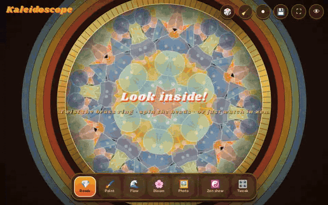
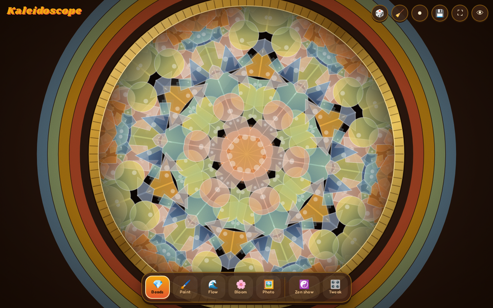
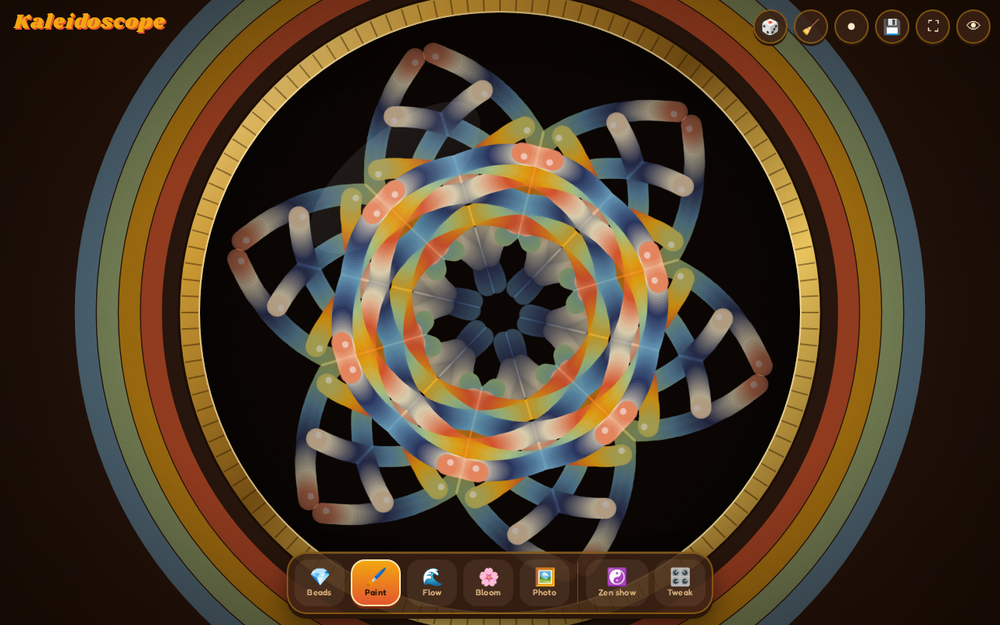
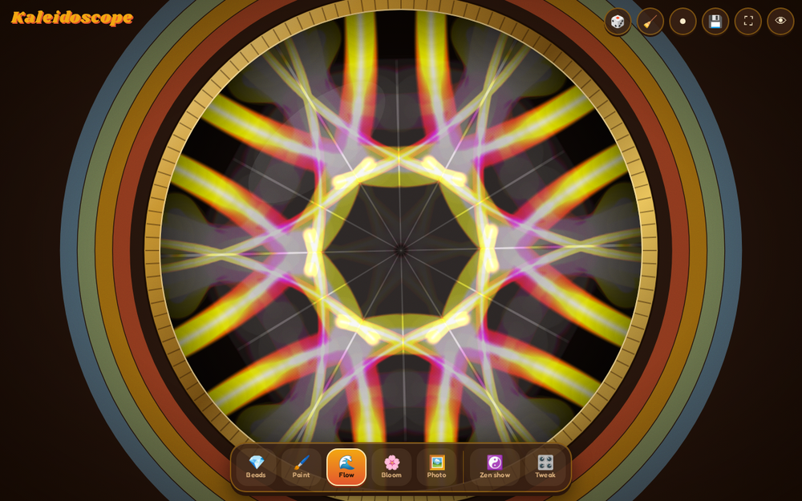
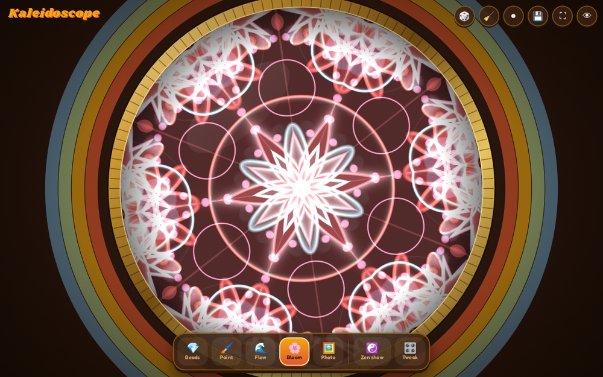
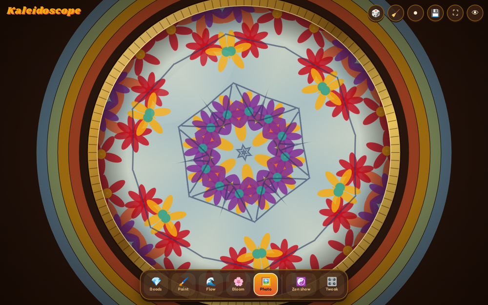
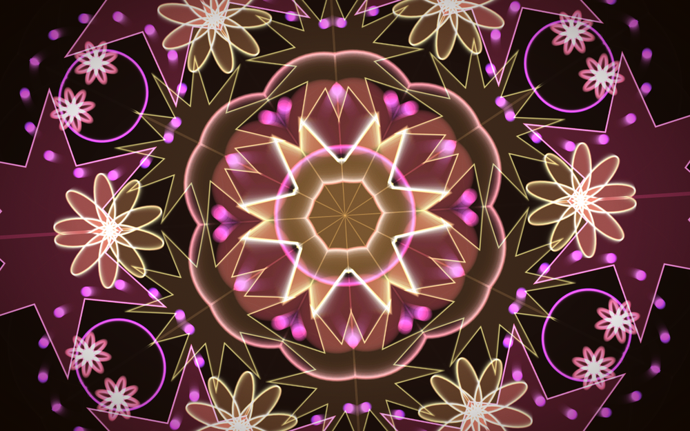
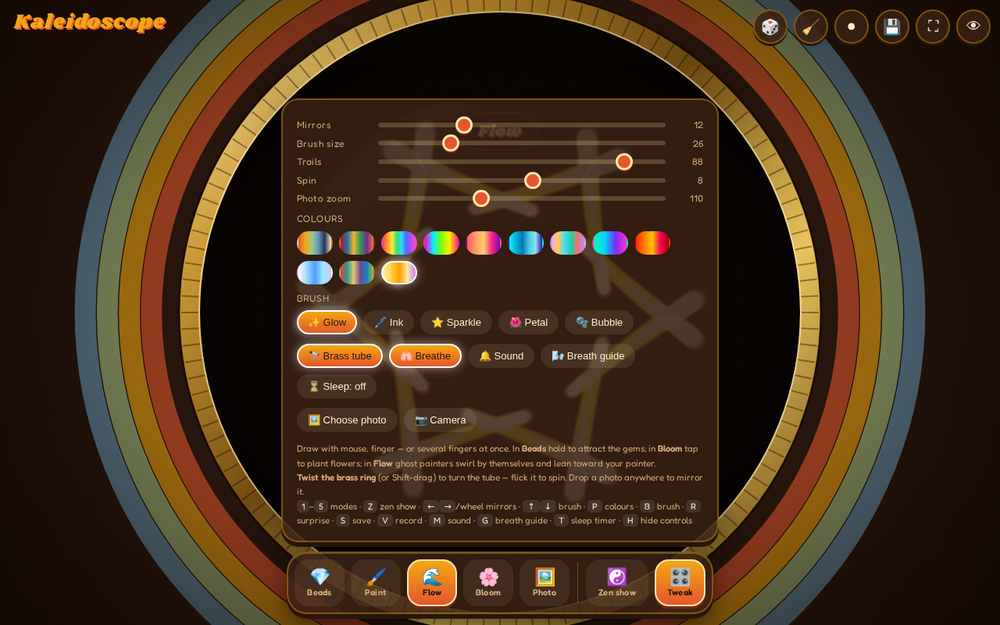
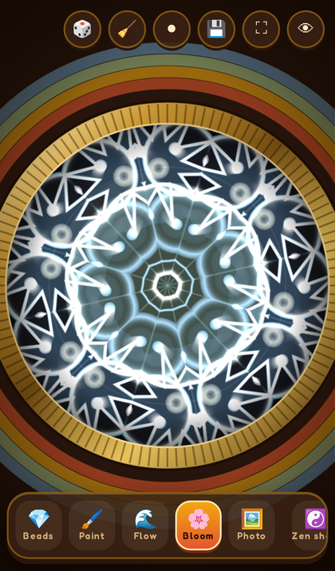

<div align="center">

# 🔭 Kaleidoscope

**A retro brass-tube kaleidoscope you can play with: tumble glass beads, paint mandalas, grow flowers, mirror your own photos, or lie back and let it dream.**

No build step and no dependencies. It's one HTML file that also works offline as an installable app.



</div>

---

## ✨ Why it's fun

Remember holding a cardboard tube up to the window and turning it slowly? This is that toy, rebuilt for screens. Every stroke, bead and flower is drawn into one wedge and reflected through up to 32 mirrors. Whatever you do turns into a symmetrical pattern, in a 1970s brass-and-orange case.

- **Five ways to play**: Beads, Paint, Flow, Bloom and Photo.
- **Turn the tube for real.** Grab the knurled brass ring and twist it. Flick it and it keeps spinning, with a soft wooden *tick* as it turns.
- **Multi-touch.** Paint with every finger at once.
- **Zen show.** A hands-free slideshow that drifts between modes, palettes and mirror counts while the controls fade away.
- **Breath guide and sleep timer.** A glowing ring paces your breathing (4 seconds in, 6 out) and the scene fades to black after 10, 20 or 30 minutes.
- **Chord-aware sound.** A warm pad cycles D → Bm → G → A, and every bead collision and brush stroke plays a note in the current chord.
- **Save and share.** Save a PNG of the view, or record a clip of up to 30 seconds (with audio) as WebM or MP4.
- **Installable PWA.** Add it to your home screen and it runs offline, fullscreen.

## 🎨 The modes

<table>
<tr>
<td width="50%"><br><b>💎 Beads</b>: Coloured glass gems tumble under gravity, bounce off each other and catch on the mirror edges. Tap to drop in more, or hold to pull them toward your finger.</td>
<td width="50%"><br><b>🖌️ Paint</b>: Draw anywhere and see it mirrored instantly. Choose from five brushes (Glow, Ink, Sparkle, Petal and Bubble) and twelve palettes.</td>
</tr>
<tr>
<td><br><b>🌊 Flow</b>: Three "ghost painters" trace slow Lissajous paths by themselves. Move your pointer and they drift toward it.</td>
<td><br><b>🌸 Bloom</b>: Rings, petals, stars and bead circles grow and fade on their own. Tap to plant a big one, or drag to scatter seedlings.</td>
</tr>
<tr>
<td><br><b>🖼️ Photo</b>: Drop any picture onto the page, or turn on the <b>camera</b> to put yourself inside the kaleidoscope. Drag to move the image around.</td>
<td><br><b>🔭 Tube off</b>: Hide the brass case and let the pattern fill the screen. Going fullscreen does this automatically.</td>
</tr>
</table>

<table>
<tr>
<td width="62%"><br><b>🎛️ Tweak panel</b>: Set mirrors, brush size, trail length, spin speed and photo zoom, and pick colours, brushes, sound, the breath guide and the sleep timer.</td>
<td width="38%" align="center"><br><b>📱 Phone friendly</b>: Touch controls, safe-area aware, and installable to your home screen.</td>
</tr>
</table>

## 🚀 Run it

Pick whichever is easiest:

```bash
# 1. Just open it
open index.html            # macOS (xdg-open on Linux, start on Windows)

# 2. Or serve it locally (needed for the offline service worker and camera)
npx http-server -c-1 .     # or: python3 -m http.server
```

Then visit <http://localhost:8080> (or `:8000` for Python).

> The camera needs a secure context, so use `localhost` or HTTPS rather than `file://`.

### Deploy

The repo is set up for **Netlify** (`netlify.toml` publishes the root folder and serves `sw.js` uncached). Any static host works, including GitHub Pages, Cloudflare Pages, Vercel or an S3 bucket: upload the files and you're done.

## 🕹️ Controls

| Action | Mouse / touch | Keyboard |
|---|---|---|
| Switch mode | Dock buttons | <kbd>1</kbd> Beads · <kbd>2</kbd> Paint · <kbd>3</kbd> Flow · <kbd>4</kbd> Bloom · <kbd>5</kbd> Photo |
| Turn the tube | Drag the brass ring (flick to spin), Shift-drag or right-drag | n/a |
| More / fewer mirrors | Mouse wheel | <kbd>←</kbd> <kbd>→</kbd> |
| Brush size | Tweak panel | <kbd>↑</kbd> <kbd>↓</kbd> |
| Next palette / brush | Tweak panel | <kbd>P</kbd> / <kbd>B</kbd> |
| Surprise me | 🎲 | <kbd>R</kbd> |
| Clear | 🧹 | <kbd>C</kbd> |
| Zen show | ☯️ | <kbd>Z</kbd> or <kbd>Space</kbd> |
| Sound on/off | Tweak → 🔔 | <kbd>M</kbd> |
| Breath guide | Tweak → 🌬️ | <kbd>G</kbd> |
| Sleep timer (off/10/20/30 min) | Tweak → ⏳ | <kbd>T</kbd> |
| Save picture | 💾 | <kbd>S</kbd> |
| Record a clip | ⏺ | <kbd>V</kbd> |
| Fullscreen | ⛶ | <kbd>F</kbd> |
| Hide / show controls | 👁, double-tap to bring back | <kbd>H</kbd> |

## 🔬 How it works

Everything is drawn into a single **source wedge**, an offscreen canvas holding one slice of the circle. Each frame that wedge is stamped around the centre *N* times. Every other copy is flipped with `scale(1,-1)`, which is how real mirror pairs behave, so the seams line up perfectly.

```
          pointer  ──fold()──▶  wedge coordinates  ──draw──▶  source canvas
                                                                   │
   screen  ◀──── N rotated, alternately mirrored copies ◀──────────┘
```

- **`fold()`** maps any screen point into the wedge: subtract the tube rotation, find which slice you're in, and reflect odd slices. Brushes, bead collisions and bloom placement all work in wedge space. That's why beads "bounce off the mirrors": hitting a wedge edge reflects their velocity.
- **Trails** come from fading the source canvas with `destination-out`. The fade is frame-rate independent, and small fade amounts are batched so low-alpha pixels still clear despite 8-bit rounding.
- **Bloom ink** is also scaled by frame time, so the pattern looks the same on 60 Hz and 120 Hz displays.
- **Audio** is pure Web Audio: five detuned sine oscillators make the pad, plus a feedback delay through a low-pass filter for the shimmer. Notes are picked from the current chord's scale based on how far from the centre they happen.
- **Recording** uses `canvas.captureStream()` mixed with the audio graph's `MediaStreamDestination`, fed into `MediaRecorder`.
- **Offline**: `sw.js` precaches the app shell. It fetches pages network-first so updates arrive, and serves assets and fonts stale-while-revalidate.

## 📁 Project layout

```
index.html             the whole app: markup, styles and script
sw.js                  service worker (offline support)
manifest.webmanifest   PWA metadata
icons/                 app icons (SVG, PNG, maskable)
media/                 README screenshots and demo GIF
netlify.toml           static hosting config
```

## 🌐 Browser support

Works in current Chrome, Edge, Firefox and Safari on desktop and mobile. A few features depend on the browser:

| Feature | Notes |
|---|---|
| Clip recording | Needs `MediaRecorder`. Chrome and Firefox save WebM, Safari saves MP4. |
| Camera | Needs HTTPS or `localhost` and permission. |
| Screen wake lock (zen show) | Chromium and Safari 16.4+. Ignored elsewhere. |
| Fullscreen | Not available for web pages on iPhone. Install to the home screen instead. |

## 🤝 Contributing

It's a single file on purpose, so it stays easy to hack on. Open `index.html`, change something, refresh. Some ideas:

- new brush styles in `stamp()`
- new palettes in `PALS`
- new bloom shapes in `drawBloom()`

---

<div align="center">
Made for slow afternoons and anyone who never grew out of looking down tubes. 🌈
</div>
